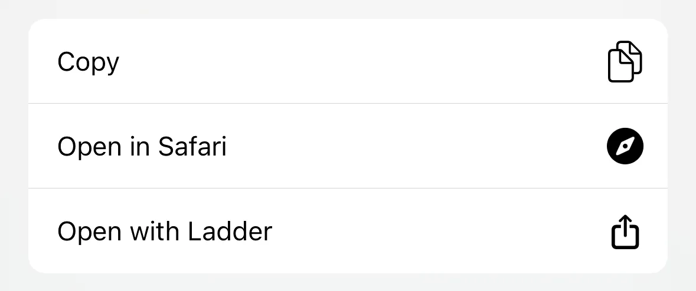

## Shortcut for Apple Shortcuts

**[Open with Ladder](https://www.icloud.com/shortcuts/f596e509ca644429bacb395002716326)** for Apple Shortcuts allows a user to easily use the share sheet to redirect a blocked URL to their instance of Ladder.

When a URL is shared, the shortcut generates a new URL to open it in Ladder: \
`https://[domain name for Ladder]/[original URL]`

When the shortcut is run with a URL, a <nobr>[URL in ladder-rules][search]</nobr> is randomly selected: \
`https://[domain name for Ladder]/test`

[search]: //github.com/search?q=repo%3Aeverywall%2Fladder-rules+url%3A&type=code

> [!NOTE]
> When adding this shortcut, your will be asked for the fully qualified domain name of your Ladder instance. <nobr>Edit the default example provided:</nobr> `ladder.account.workers.dev`

### Add Shortcut

shared link: [Get Shortcut][iCloud] `iCloud` \
exported file: [Open with Ladder.shortcut][file] `GitHub`

[iCloud]: //www.icloud.com/shortcuts/f596e509ca644429bacb395002716326
[file]: <./Open with Ladder.shortcut>

### Source Code

source code: [Open with Ladder.plist](<./Open with Ladder.plist>) `PLIST` `XML`

Apple Shortcuts nolonger directly supports importing unsigned shortcuts or shorcut source code. Use these shortcuts to manage and sign source code.

1. [Shortcut Source Tool](https://routinehub.co/shortcut/5256/)
2. [Shortcut Source Helper](https://routinehub.co/shortcut/10060) \
   macOS: signs shortcuts locally \
   iOS: signs shortcuts with [Remote Sign][worker] (service run by shortcut develoepr [gluebyte][profile])

[worker]: http://shortcuts.gluebyte.workers.dev
[profile]: https://routinehub.co/user/gluebyte

